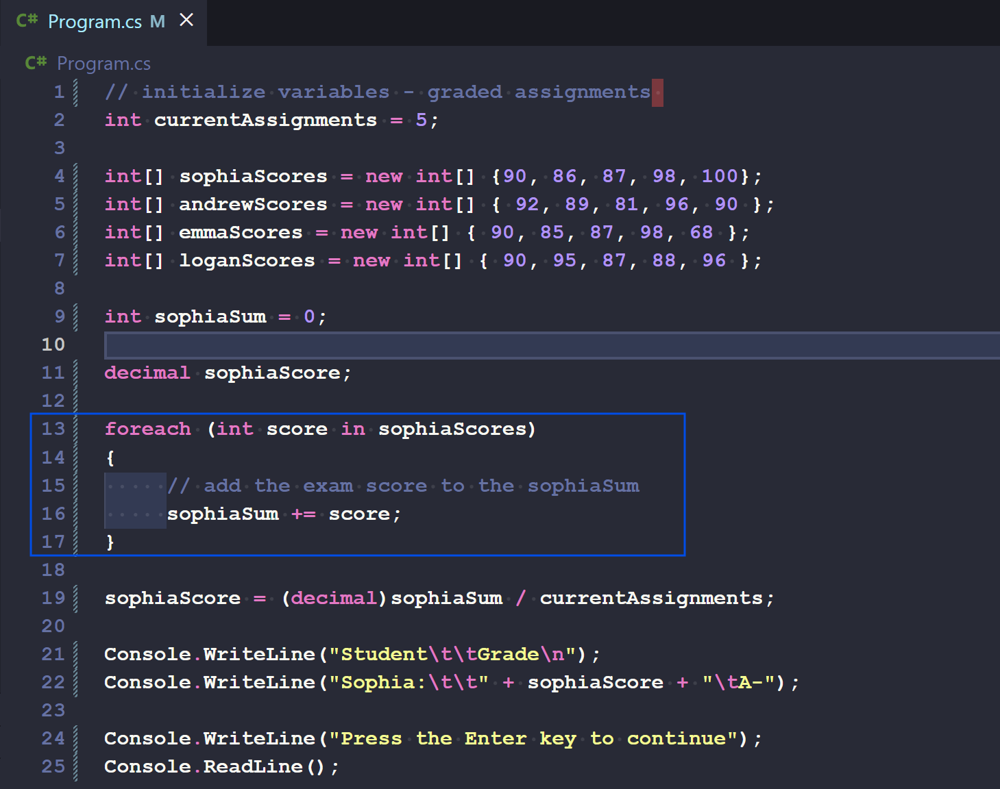
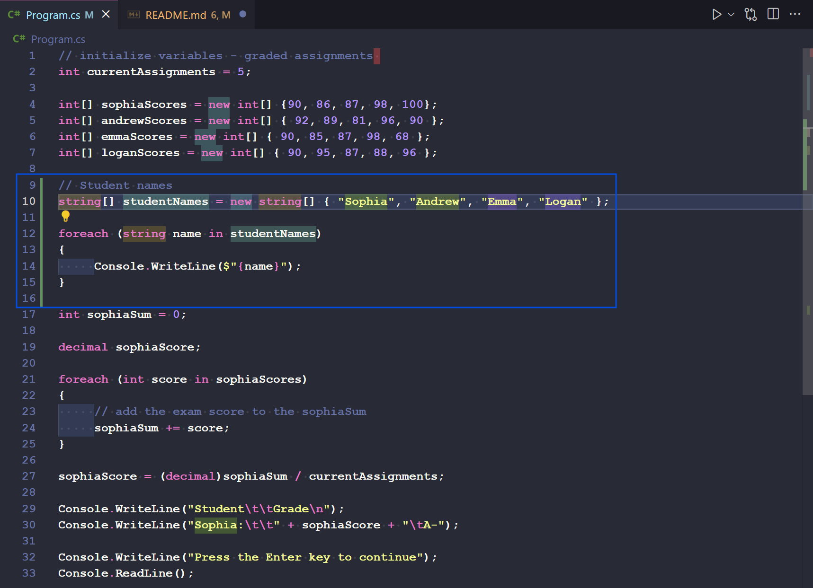

# Guided_Project_Grade Calculations

### Create arrays and foreach loops

**Step 1**. See lines 13-17. `foreach` is used in this piece of code. 

#

### Create a student names array and outer foreach loop.

**Step 2**. See lines 10 through 15. 

     - Added this block of code. To verify that your foreach loop is iterating through the studentNames array as intended, update the code block of the foreach statement as follows:

#

### Calculate Sophia's score inside the outer names loop

